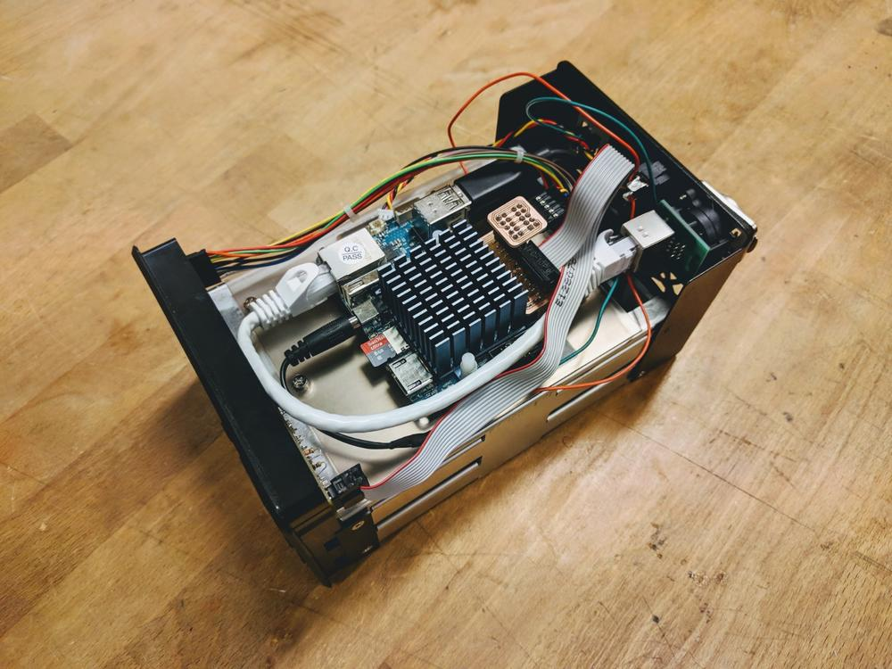

# NAS Mod

## Description

This project started with the objective to turn a USB RAID storage system into a NAS (Network-Attached Storage) unit. In reality, it was more of a (very much needed) exercise in embedded Linux.

The essence of the idea is to modify a [GR3680-SB3](https://www.raidsonic.de/products/external_cases/soho_raid/index_en.php?we_objectID=2984) by replacing the proprietary board with a Raspberry Pi or an ODROID-XU4. This involves:

  - Connecting the LCD, control buttons, and LED's to the new board(s) properly.
  - Interfacing Linux with this extra hardware.
  - Writing a piece of code to make use of it.

Given how surprisingly scarce, scattered, cryptic, or incomplete Linux resources on this subject can be (at least for an advanced beginner), this repo serves not only as a reference for this particular implementation but also as a tutorial for interacting with basic hardware in Linux. The emphasis is not on NAS software itself.


## Quick guide

There is a number of Makefile's to automate the setup. Keep in mind that several parameters are hard-coded and things may easily break. See the detailed documentation when that happens.

Assuming you have [Linux set up](docs/02-linux-setup.md) properly, clone this repo and run `make` in each of the following directories and then reboot at the end:

- Pi
    ```
    /code/02-device-tree/pi
    /code/03-python
    /code/04-systemd-service # (manually change path in Makefile)
    ```
- XU4
    ```
    /code/01-modules
        # make NAME=charlcd
        # make NAME=charlcd
        # echo 'charlcd' | sudo tee -a /etc/modules
        # echo 'hd44780' | sudo tee -a /etc/modules
        # sudo depmod

    /code/02-device-tree/xu4
    /code/03-python
    /code/04-systemd-service # (manually change path in Makefile)
    ```

## Detailed documentation

_aka: The Missing Tutorial on How to Use Basic Hardware in Linux_

- [Hardware](docs/01-hardware.md)
- [Linux setup](docs/02-linux-setup.md)
- [How to interact with GPIO's](docs/03-gpios.md)
- [Drivers and modules](docs/04-drivers-modules.md)
- [Device tree](docs/05-device-tree.md)
- [Testing](docs/06-testing.md)
- [Python](docs/07-python.md)
- [Auto-start script](docs/08-autostart.md)

## Known issues

- Jittery backlight on startup, power off, and more.
- LCD animation better when looking at some angles (but not straight on).
- Scrolling with values that change frequently (multiple values in a line or temperature).
- Clock skipping a second occasionally.
- Last message remains after power off then on
- Not sure where these default messages come from:
    - Kernel version on startup.
    - "Power off" on shutdown.
    - "LCD driver unloaded" when `hd44780` module is removed, e.g. with `rmmod`.
    - "Reloading System ..." on reboot.

## Gallery


_                   |_
--------------------|--------------------
 |  
 |  
 |  